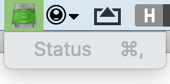

# AppKitified

## A collection of AppKit APIs in a Catalyst

This is a start to integrate a couple of APIs, based on those 2 amazing blog posts:

- [Plugin Architecture in Swift(ish)](https://blog.pendowski.com/plugin-architecture-in-swift-ish/)
- [Beyond the Checkbox with Catalyst and AppKit](https://www.highcaffeinecontent.com/blog/20190607-Beyond-the-Checkbox-with-Catalyst-and-AppKit)

Thanks to [Mhd Hejazi](https://twitter.com/Hejazi) also — Check out his [Dynamic Library](https://github.com/mhdhejazi/Dynamic)

This is only the beginning, for now, I only have the way to add a Status Bar to your Catalyst App, but this is a very important beginning!

This is done with a litte bit of necessary ObjC for the Protocol, but the rest is only Swift!
